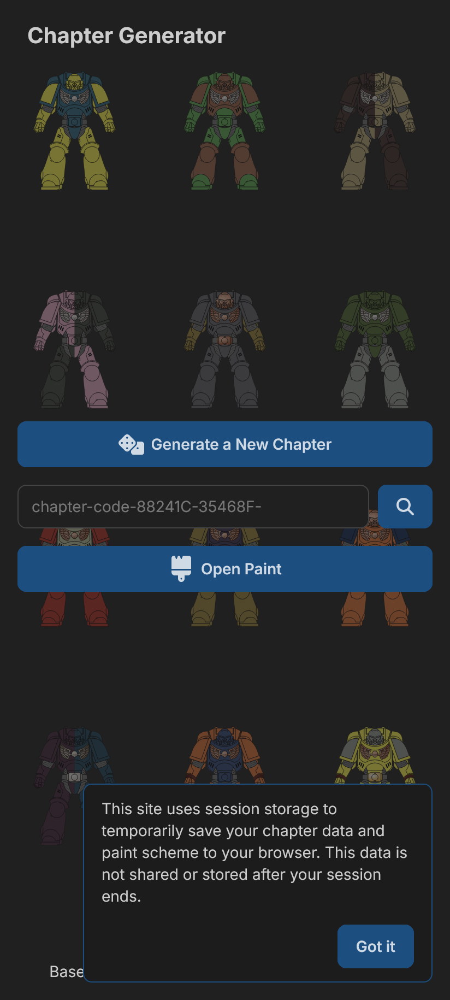
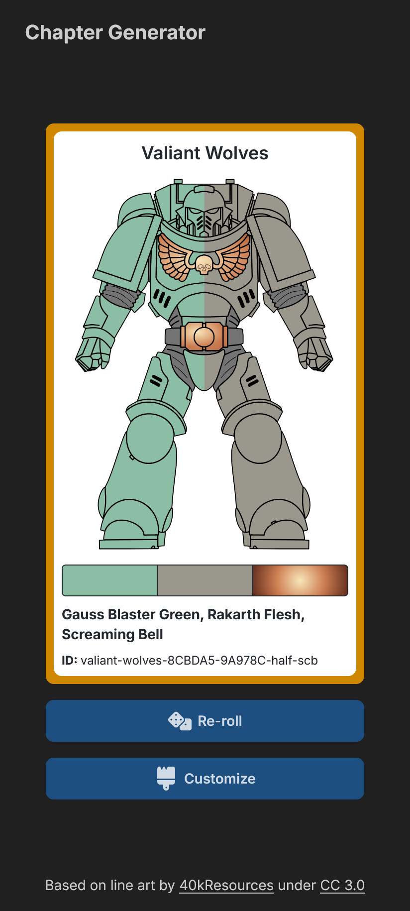
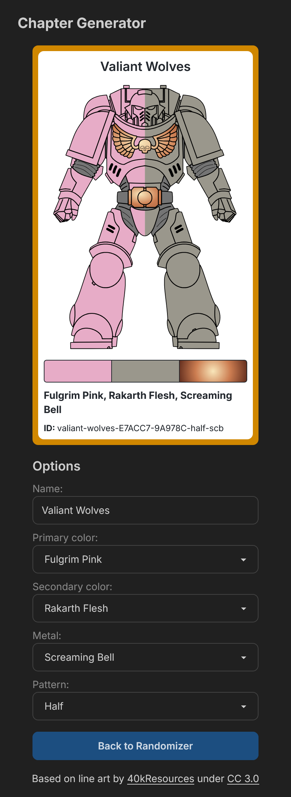
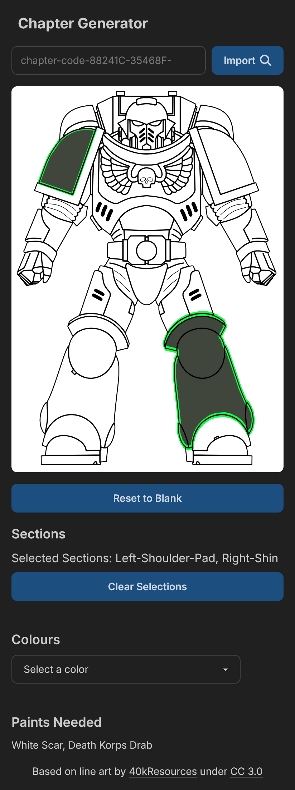

# Chapter Generator

> [!NOTE]
> This is an unofficial fan-made project and is not affiliated with Games Workshop.

Chapter Generator is a web-based hobby tool for creating and customizing Warhammer-inspired paint schemes for multiple faction styles, including loyalist chapters, chaos warbands, and Aeldari warhosts.

It is designed as a fast inspiration tool for painters who want randomized schemes, manual customization, and shareable results.

## Features

- **Random scheme generation**  
  Generate faction-themed colour schemes for loyalist, chaos, and xenos-inspired forces.

- **Multiple faction flows**  
  Includes support for Space Marine chapters, Chaos warbands, and Aeldari warhosts.

- **Manual customization**  
  Fine-tune generated schemes with painter tools and custom colour selection.

- **Free Paint mode**  
  Colour model sections manually and review the paints used.

- **Shareable slug-based results**  
  Generated schemes can be revisited and shared using unique URLs.

- **Mobile-friendly UI**  
  Built with a responsive interface for desktop and mobile use.

## Screenshots

| Home Screen                             | Chapter Generator                          |
| --------------------------------------- | ------------------------------------------ |
|  |  |

| Chapter Customizer                                     | Free Paint                             |
| ------------------------------------------------------ | -------------------------------------- |
|  |  |

## Getting Started

To run this project locally, follow these steps:

### 1️⃣ Clone the Repository

```sh
git clone https://github.com/James-Sundby/chaos-generator.git
cd chaos-generator
```

### 2️⃣ Install Dependencies

```sh
npm install
# or
yarn install
```

### 3️⃣ Run the App

```sh
npm run dev

# or

yarn dev
```

The app will be available at http://localhost:3000

## How It Works

Generated schemes are encoded into shareable slugs. These slugs can be used to:

- revisit a generated scheme
- share a scheme with others
- look up an existing scheme through the search tools

Different faction flows use their own generation, parsing, and painter logic while sharing common UI components.

## State Management

This project uses Zustand for client-side state management across faction-specific flows.

Zustand stores are used for:

- generated scheme data
- customizer state
- painter flows
- preserving faction data between generation and customization pages

## Tech Stack

- **Next.js** – App Router-based React framework
- **Tailwind CSS** – Utility-first styling
- **daisyUI** – UI component layer built on Tailwind
- **Zustand** – Lightweight state management
- **Custom generation/parsing utilities** – Slug generation, parsing, and scheme handling

## Project Goals

This project is intended to help hobbyists:

- break painter’s block
- explore unusual colour combinations
- build inspiration for custom forces
- preview schemes before committing paint to miniatures

## Contributing

If you have suggestions or improvements, feel free to open an issue or submit a pull request.

## Disclaimer

This project is an unofficial fan tool and is not affiliated with, endorsed by, or supported by Games Workshop.

All names, logos, characters, and distinctive likenesses related to Warhammer 40K are the intellectual property of Games Workshop. This tool does not use any official artwork, rules, or assets, and is intended solely for non-commercial, fan-driven hobby use.

## License

This project is open source and available under the [MIT License](LICENSE).
