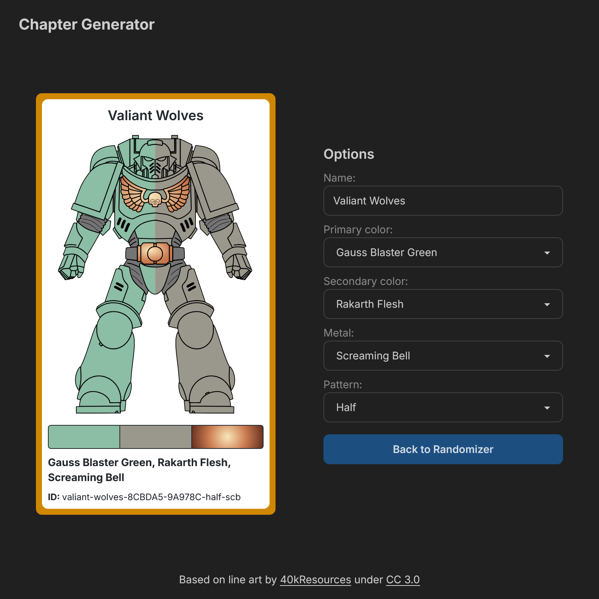

# Space Marine Chapter Generator

A web-based tool for Warhammer 40K hobbyists to create unique Space Marine chapter color schemes. Generates random color combinations for armor, weapons, and heraldry.



## Features

- **Randomized color schemes** – Generates three unique colors for your chapter.
- **Inspiration for painters** – Helps hobbyists visualize unique Space Marine liveries.
- **Simple and fast** – Generate new schemes with a single click.
- **Accessible design** – Mobile-friendly interface with a clean UI.

## 📸 Screenshots

| Home Screen                                            | Chapter Generator                          |
| ------------------------------------------------------ | ------------------------------------------ |
|                 |  |
| Chapter Customizer                                     | Free Paint                                 |
| ---------------------------------                      | --------------------------------           |
|  |      |

## Getting Started

To run this project locally, follow these steps:

### 1️⃣ Clone the Repository

```sh
git clone https://github.com/James-Sundby/chaos-generator.git
cd chaos-generator
```

### 2️⃣ Install Dependencies

```sh
npm install
# or
yarn install
```

### 3️⃣ Run the App

```sh
npm run dev

# or

yarn dev
```

The app will be available at http://localhost:3000

## API

The Space Marine Generator includes a dynamic API endpoint that allows users to generate and retrieve Space Marine chapter details based on a unique slug.

### **Endpoint**

```
GET /api/chapter-generator
```

### **Query Parameters**

- **slug** _(optional)_ – If provided, the API will parse the slug and return the corresponding warband details. Otherwise, a new warband will be generated.

### **Response Format**

A successful request returns JSON with the following structure:

```json
{
  "message": "new warband",
  "warbandName": "The Virtuous Storm",
  "colors": [
    { "hex": "#664A22", "name": "XV-88" },
    { "hex": "#8CBDA5", "name": "Gauss Blaster Green" }
  ],
  "pattern": "Quartered",
  "slug": "the-virtuous-storm-664A22-8CBDA5-arms-ldb",
  "metal": {
    "code": "ldb",
    "name": "Leadbelcher",
    "hex1": "#f0f0f0",
    "hex2": "#8a8a8a",
    "hex3": "#152724"
  }
}
```

If the slug is invalid or not provided, a new warband is generated.

## State Management with Zustand

This project uses Zustand for managing application state across various pages. Zustand handles:

- **Generated Warband Data** – Stores chapter name, colors, armor pattern, and associated metal.

## Tech Stack

- **Next.js** – React framework for fast and scalable web apps.
- **Tailwind CSS** – Styling for a clean and modern UI.
- **Zustand** – Lightweight state management.
- **Custom API** – Fetches random color combinations and generates Space Marine chapter names dynamically.

## Contributing

If you have suggestions or improvements, feel free to open an issue or submit a pull request.

## License

This project is open source and available under the [MIT License](LICENSE). x
